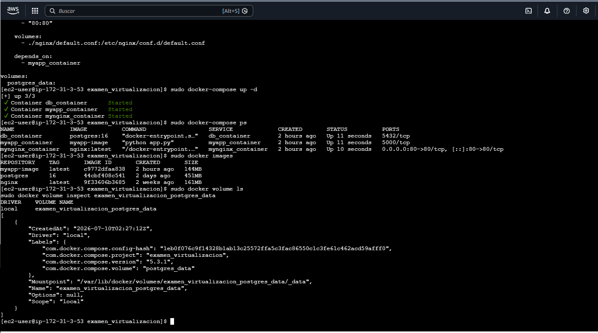
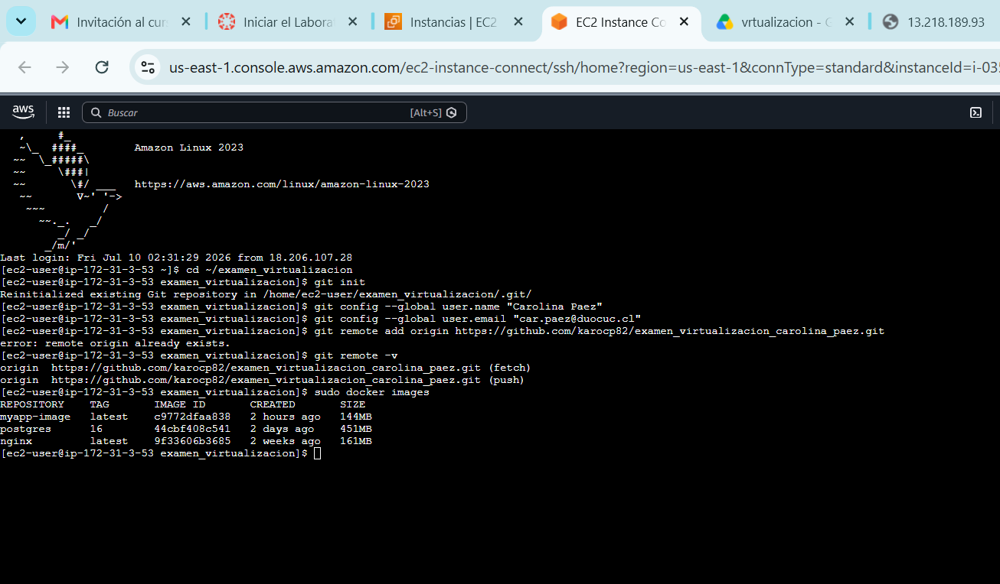

Examen Virtualización - Carolina Páez
Autor

Carolina Páez

Descripción del Proyecto

Este proyecto corresponde al desarrollo e implementación de una solución basada en contenedores Docker desplegada sobre una instancia EC2 de AWS.

La solución considera una arquitectura multicontenedor compuesta por:

NGINX como servidor web y proxy inverso.
Aplicación Flask desarrollada en Python.
Base de datos PostgreSQL con persistencia mediante volúmenes Docker.

La aplicación registra visitas y almacena la información en PostgreSQL, permitiendo mantener los datos incluso después del reinicio de los contenedores.

Justificación Técnica

Para el desarrollo de esta solución opté por utilizar Docker debido a que permite desplegar aplicaciones de manera rápida, portable y eficiente.

A diferencia de las máquinas virtuales tradicionales, los contenedores comparten recursos del sistema operativo anfitrión, reduciendo el consumo de recursos y facilitando la administración de los servicios.

Docker Compose fue utilizado para administrar los distintos contenedores desde un único archivo de configuración, simplificando la implementación y la comunicación entre los servicios.

Respecto a la infraestructura, se utilizó AWS EC2 debido a su disponibilidad, facilidad de acceso remoto y capacidad para desplegar entornos similares a los utilizados en escenarios reales de infraestructura tecnológica.

Arquitectura de la Solución

La arquitectura implementada está compuesta por tres servicios:

NGINX

Servidor web encargado de recibir las solicitudes HTTP de los usuarios y redirigirlas hacia la aplicación Flask.

Aplicación Flask

Aplicación desarrollada en Python encargada de procesar las solicitudes y registrar el contador de visitas.

PostgreSQL

Base de datos relacional utilizada para almacenar la información generada por la aplicación.

Flujo de funcionamiento
Usuario
   │
   ▼
NGINX
   │
   ▼
Aplicación Flask
   │
   ▼
PostgreSQL
Tecnologías Utilizadas
AWS EC2
Amazon Linux 2023
Docker
Docker Compose
Python Flask
PostgreSQL 16
NGINX
Git
GitHub
Estructura del Proyecto
examen_virtualizacion/
│
├── app/
│   ├── app.py
│   └── requirements.txt
│
├── nginx/
│   └── default.conf
│
├── evidencias/
│
├── Dockerfile
│
├── docker-compose.yml
│
└── README.md
Procedimiento de Despliegue
1. Clonar el repositorio
git clone https://github.com/karocp82/examen_virtualizacion_carolina_paez.git
cd examen_virtualizacion_carolina_paez
2. Verificar Docker
docker --version
3. Verificar Docker Compose
docker-compose --version
4. Levantar la solución
docker-compose up -d
5. Verificar contenedores
docker-compose ps

Resultado esperado:

db_container
myapp_container
mynginx_container
6. Acceder a la aplicación

Abrir navegador y acceder a la IP pública de la instancia EC2.

http://IP_PUBLICA_EC2
7. Verificar persistencia

Reiniciar los servicios:

docker-compose restart

Acceder nuevamente a la aplicación y comprobar que el contador continúa incrementándose.

Evidencias
Evidencia 1 – Creación de la instancia EC2

Se creó una instancia EC2 sobre AWS que actuó como infraestructura para desplegar la solución.

Evidencia 2 – Instalación de Docker

Instalación del motor Docker sobre Amazon Linux 2023.

Evidencia 3 – Verificación del servicio Docker

Comprobación del estado operativo del servicio Docker.

Evidencia 4 – Instalación de Docker Compose

Instalación y verificación de Docker Compose.

Evidencia 5 – Creación del directorio del proyecto

Creación de la estructura inicial del proyecto.

Evidencia 6 – Creación del archivo docker-compose.yml

Definición de los servicios mediante Docker Compose.

Evidencia 7 – Despliegue del stack completo

Levantamiento de la solución mediante Docker Compose.

Evidencia 8 – Contenedores activos

Verificación de los tres servicios ejecutándose correctamente.

Evidencia 9 – Imagen personalizada creada

Construcción de la imagen Docker propia de la aplicación Flask.

Evidencia 10 – Imágenes Docker utilizadas

Verificación de las imágenes utilizadas por la solución.

Evidencia 11 – Volumen persistente PostgreSQL

Comprobación del volumen utilizado para almacenar la información de PostgreSQL.

Evidencia 12 – Inspección del volumen

Validación de la configuración interna del volumen persistente.

Evidencia 13 – Docker Inspect

Inspección de la configuración interna del contenedor Flask.

Evidencia 14 – Aplicación funcionando

Validación del funcionamiento de la aplicación mediante el contador de visitas.

Evidencia 15 – Aplicación publicada

Acceso a la aplicación mediante navegador web.

Evidencia 16 – Persistencia de datos

Comprobación de que los datos permanecen después del reinicio de los contenedores.

Evidencia 17 – Instalación de Git

Instalación de Git para el control de versiones.

Evidencia 18 – Configuración y asociación con GitHub

Configuración del repositorio remoto y verificación de conectividad con GitHub.

Repositorio GitHub

Repositorio utilizado para almacenar el código fuente y documentación del proyecto:

https://github.com/karocp82/examen_virtualizacion_carolina_paez

Resultados Obtenidos

Durante la implementación se logró:

Desplegar una arquitectura multicontenedor.
Configurar comunicación entre servicios.
Crear una imagen Docker personalizada para la aplicación Flask.
Implementar persistencia mediante volúmenes Docker.
Publicar la aplicación en AWS EC2.
Gestionar el proyecto mediante Git y GitHub.
Verificar el funcionamiento del stack completo mediante Docker Compose.
Comprobar la persistencia de los datos después del reinicio de los contenedores.
Conclusión

Durante esta evaluación implementé una solución basada en contenedores Docker desplegada sobre una instancia EC2 de AWS.

La arquitectura desarrollada integra NGINX, una aplicación Flask desarrollada en Python y una base de datos PostgreSQL con almacenamiento persistente mediante volúmenes Docker.

Las pruebas realizadas permitieron validar la correcta comunicación entre servicios, la publicación de la aplicación en Internet, la persistencia de los datos y la administración de la solución mediante Docker Compose.

Esta implementación demuestra las ventajas de la virtualización basada en contenedores, permitiendo desplegar aplicaciones de forma eficiente, portable y escalable utilizando tecnologías ampliamente utilizadas en entornos profesionales de infraestructura y plataformas tecnológicas.
